# 🤖 ContaBot — AI-Powered Personal Accounting Agent

A conversational AI agent that automates personal accounting through Telegram. Just send a message describing a transaction and ContaBot structures, categorizes, and records it in a PostgreSQL database — ready for financial analysis.

---

## 📌 Overview

Managing personal finances manually is tedious and error-prone. ContaBot solves this by letting you register transactions in natural language through a Telegram chat, using an AI agent to handle the accounting logic automatically.

**Example interaction:**

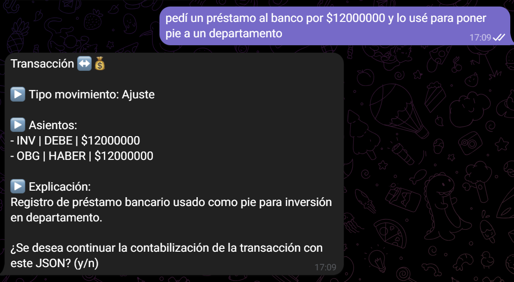

ContaBot handles **double-entry accounting** (partida doble) — not just simple expense tracking. It correctly identifies Debit/Credit entries, transaction types (expenses, income, adjustments), and provides an accounting explanation before the user confirms.

---

## 🏗️ Architecture

```
Telegram Chat
      │
      ▼
  Webhook (ngrok tunnel → n8n local)
      │
      ▼
┌─────────────────────────────────────┐
│           n8n Workflow              │
│                                     │
│  State Machine (consecutive states) │
│  ┌──────────────────────────────┐   │
│  │ 1. Parse transaction         │   │
│  │    (Gemini AI Agent)         │   │
│  │ 2. Show preview to user      │   │
│  │ 3a. Confirm → Categorize     │   │
│  │ 3b. Reject  → Rectify        │   │
│  │ 4. Register in PostgreSQL    │   │
│  └──────────────────────────────┘   │
└─────────────────────────────────────┘
      │
      ▼
  PostgreSQL DB → Dashboard / Analysis
```

The workflow uses a **state machine pattern** to handle multi-turn conversations through a single webhook trigger — each message advances the state depending on the user's response.

### Full Workflow Overview

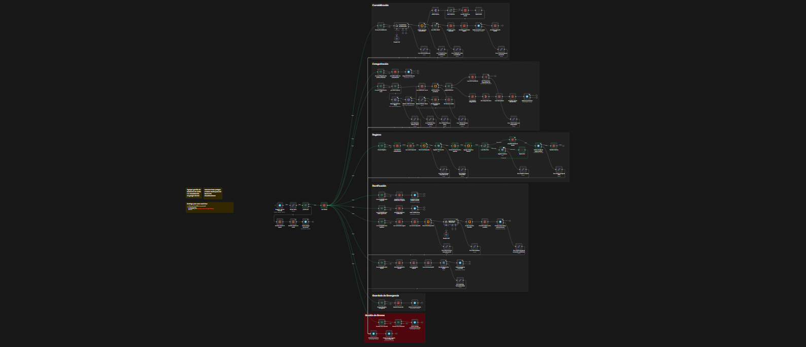

### Core Entry & Routing

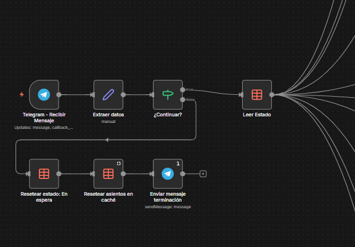

### Workflow Phases (Detail)

**Accounting Phase** — AI Agent parses the transaction and proposes double-entry accounting:

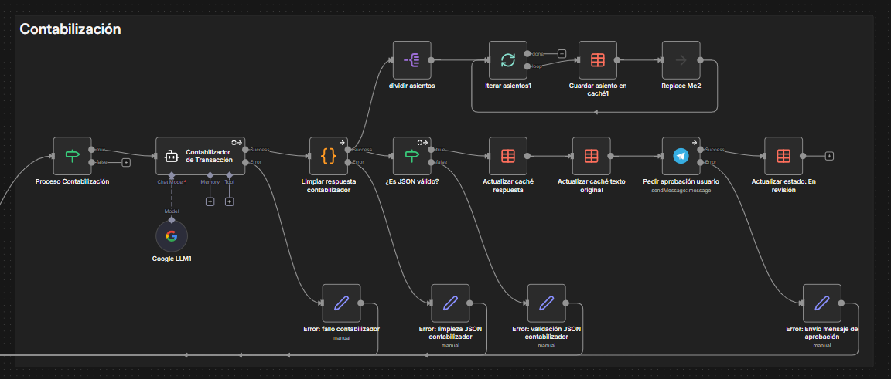

**Categorization Phase** — Iterative chat-based categorization of each accounting entry:

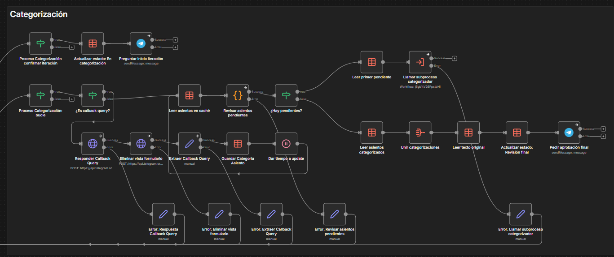

**Rectification Phase** — User feedback loop if the AI misunderstood the transaction:

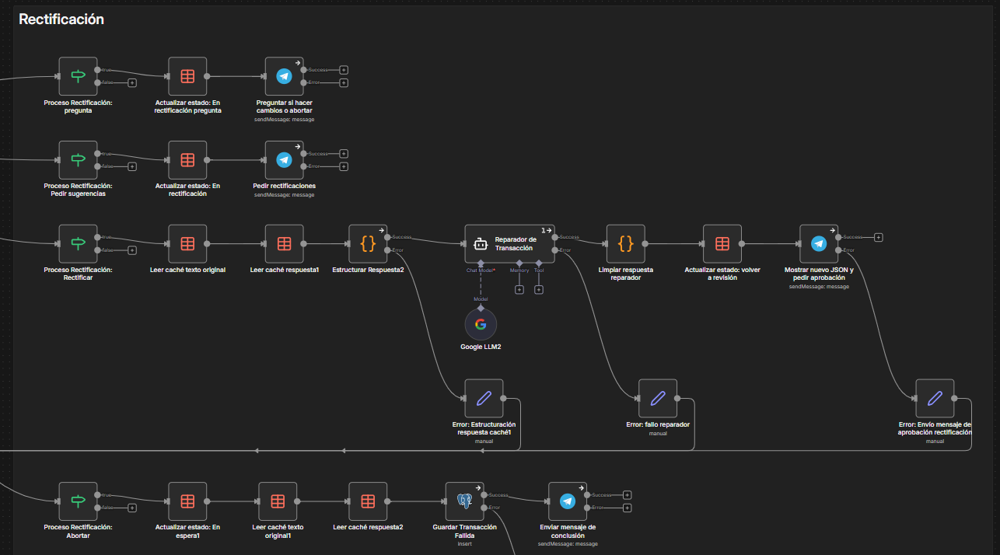

---

## ✨ Features

- 💬 **Natural language input** — describe transactions as you would in a conversation
- 🧠 **AI-powered structuring** — Gemini parses and formats transactions following accounting standards
- ✅ **Human-in-the-loop** — user confirms or rejects each transaction before it's recorded
- 🔁 **Rectification flow** — if the AI misunderstood, the user provides feedback and it tries again
- 🗂️ **Interactive categorization** — guided categorization of accounting entries via chat
- 🗄️ **PostgreSQL persistence** — structured storage ready for BI/dashboard integration
- ⚙️ **Modular design** — main workflow + subprocess for categorization logic

### Demo: Interactive Categorization

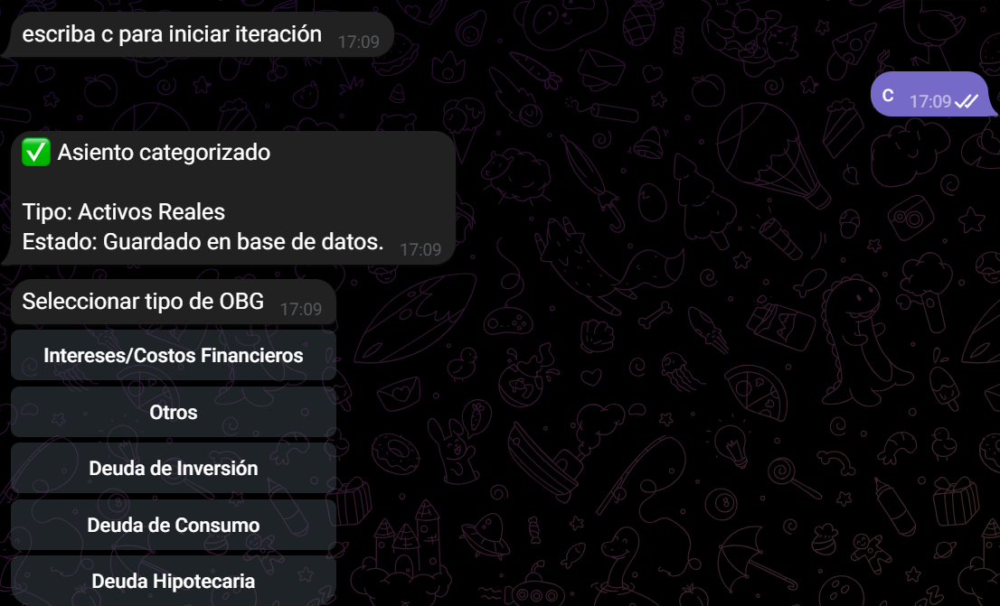

### Demo: Final Confirmation & Registration

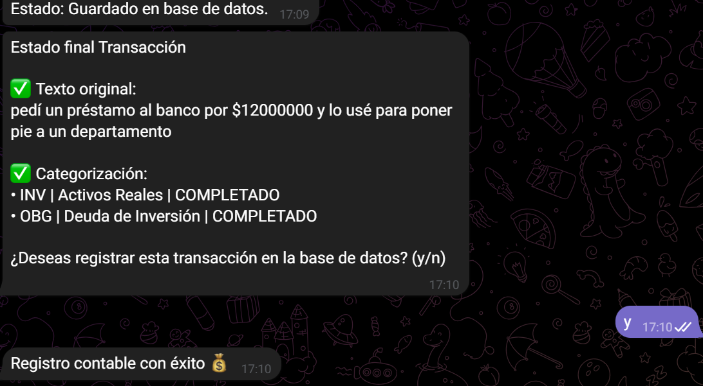

### Demo: Error Handling

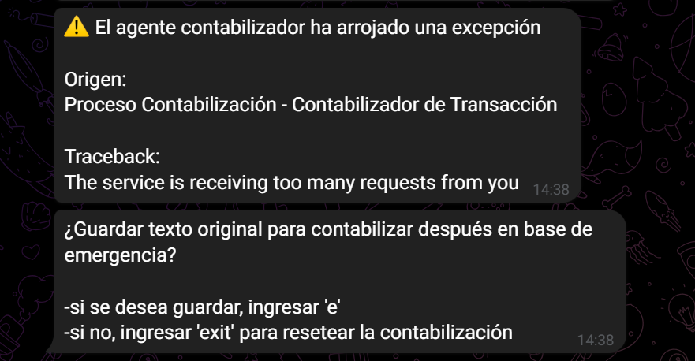

---

## 🛠️ Tech Stack

| Layer | Tool |
|---|---|
| Conversation interface | Telegram Bot API |
| Workflow orchestration | n8n (self-hosted) |
| AI Agent | Google Gemini (via n8n AI Agent node) |
| Data processing | Python (embedded in n8n Code nodes) |
| Database | PostgreSQL |
| Local tunnel | ngrok |

---

## 📂 Repository Structure

```
n8n-accounting-automation/
│
├── workflow/
│   ├── accounting_main.json        ← Main n8n workflow (export)
│   └── accounting_subprocess.json  ← Categorization subprocess
│
├── docs/
│   └── *.png                       ← Workflow diagrams and Telegram demo screenshots
│
└── README.md
```

---

## 🚀 Setup & Deployment

### Prerequisites

- [n8n](https://n8n.io/) (self-hosted, local)
- [ngrok](https://ngrok.com/) account (for Telegram webhook tunnel)
- Telegram Bot (create via [@BotFather](https://t.me/BotFather))
- Google Gemini API key
- PostgreSQL instance

### Steps

**1. Clone the repository**
```bash
git clone https://github.com/your-username/n8n-accounting-automation.git
```

**2. Start n8n locally**
```bash
n8n start
```

**3. Expose local server with ngrok**
```bash
ngrok http 5678
```
Copy the generated HTTPS URL — you'll use it as your Telegram webhook.

**4. Import the workflows into n8n**
- Go to `localhost:5678`
- Click `+` → `Import from file`
- Import `accounting_main.json` first, then `accounting_subprocess.json`

**5. Configure credentials in n8n**
Add the following credentials in n8n's Credentials section (never hardcoded):
- Telegram Bot API token
- Google Gemini API key
- PostgreSQL connection string

**6. Set the Telegram webhook**
```
https://api.telegram.org/bot<YOUR_TOKEN>/setWebhook?url=<YOUR_NGROK_URL>/webhook/<WEBHOOK_ID>
```

**7. Activate the workflow and start chatting with your bot 🎉**

---

## 💡 Key Design Decisions

**State machine via single webhook:** Rather than using multiple triggers, the workflow manages conversation state internally. Each incoming message is routed based on the current state stored per user, enabling multi-turn conversations through one endpoint.

**Human-in-the-loop by design:** The AI structures the transaction but never records it without explicit user confirmation. This prevents silent errors in financial data.

**Subprocess for categorization:** The categorization logic is isolated in a separate n8n workflow, keeping the main flow clean and making it easier to modify the categorization logic independently.

### AI Agent System Prompt

The Gemini agent is configured with a detailed accounting system prompt that defines valid account codes, output JSON format, and accounting rules:

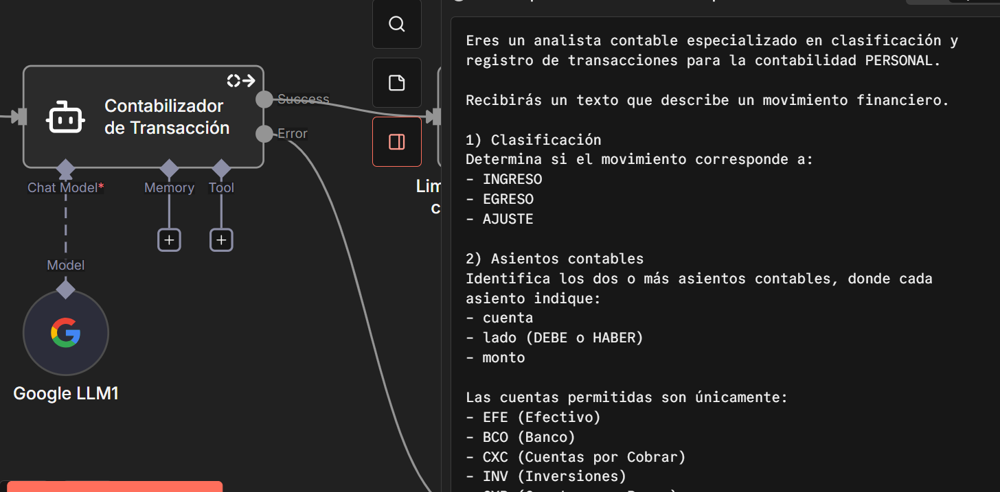

---

## 📊 Database Schema

Normalized design with 5 tables, separating transaction headers, double-entry accounting entries, account catalog, entry categories, and failed transactions:

```sql
-- Main transaction record
CREATE TABLE transacciones (
    id              SERIAL4 PRIMARY KEY NOT NULL,
    fecha           TIMESTAMP NOT NULL,
    tipo_movimiento VARCHAR(10),
    descripcion     TEXT,
    created_at      TIMESTAMP
);

-- Double-entry accounting entries (partida doble)
-- Each transaction has 2+ entries: DEBE and HABER must balance
CREATE TABLE asientos (
    id              SERIAL4 PRIMARY KEY NOT NULL,
    transaccion_id  INT4 REFERENCES transacciones(id),
    cuenta_codigo   VARCHAR(10),          -- FK to cuentas.codigo
    lado            VARCHAR(5),           -- 'DEBE' | 'HABER'
    monto           NUMERIC(12,2) NOT NULL,
    categoria       VARCHAR
);

-- Chart of accounts — defines valid account codes used in asientos
CREATE TABLE cuentas (
    id      SERIAL4 PRIMARY KEY NOT NULL,
    codigo  VARCHAR(20) NOT NULL,
    nombre  VARCHAR(100) NOT NULL,
    tipo    VARCHAR(20) NOT NULL,
    activa  BOOL
);

-- Category catalog for accounting entries
CREATE TABLE cat_asientos (
    id              SERIAL4 PRIMARY KEY NOT NULL,
    codigo_asiento  VARCHAR(10) NOT NULL,
    categoria       VARCHAR(100) NOT NULL
);

-- Transactions that failed or were rejected during AI structuring
CREATE TABLE trans_fallidas (
    id              SERIAL4 PRIMARY KEY NOT NULL,
    texto_original  TEXT NOT NULL,
    json_generado   TEXT,
    error           TEXT,
    estado          VARCHAR(20),
    fecha_evento    TIMESTAMP,
    created_at      TIMESTAMP,
    proceso_origen  VARCHAR
);
```

### Live Data Example

Real entries in the `asientos` table after processing the example transaction:

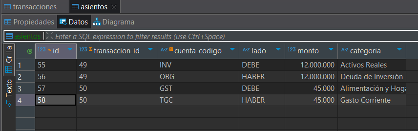

---

## 🔮 Future Improvements

- [ ] Dashboard integration (Power BI / Metabase)
- [ ] Monthly summary reports automation
- [ ] Multi-user support
- [ ] Cloud deployment (Railway / Render)

---

## 👤 Author

**Renato Catalán** — [LinkedIn](https://linkedin.com/in/renato-catalán-muñoz) · [GitHub](https://github.com/renatogcatalan)

*Business Engineer @ Universidad de Chile | Data Science & AI Automation*